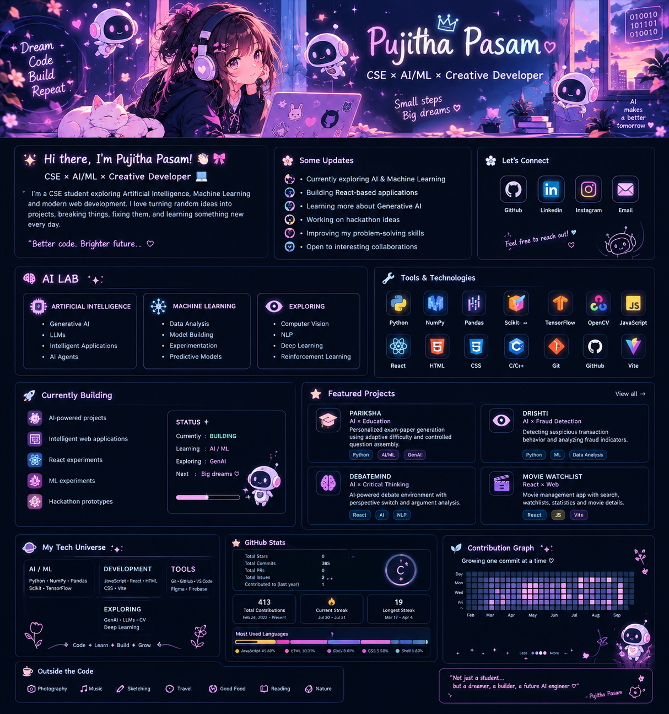

# 🎀 Hey, I'm Pujitha Pasam! 🌸

### `CSE × AI/ML × Creative Developer` 🤖

---

## 🌷 Hi there!

I'm **Pujitha Pasam**, a CSE student exploring **Artificial Intelligence, Machine Learning and modern web development**.

I enjoy taking random ideas, turning them into projects, breaking things, fixing them, and learning something new along the way. 🎀

> `learning → building → experimenting → repeating` ✨

---

## 🎀 Some Updates

- 🤖 Currently exploring **AI & Machine Learning**
- 💻 Building **React-based applications**
- 🧠 Learning more about **Generative AI & LLMs**
- 🚀 Working on **hackathon projects**
- 🌱 Improving my **problem-solving skills**
- ✨ Turning ideas into things that actually work

---

## 🛠️ Tools & Technologies

---

## 🚀 Currently Building

<table>
<tr>
<td width="60%">

- 🤖 AI-powered projects
- 💻 Intelligent web applications
- ⚛️ React experiments
- 🧠 ML experiments
- 🚀 Hackathon prototypes

</td>
<td width="40%" align="center">

### STATUS ✦

🟢 **BUILDING**

**Learning:** AI / ML  
**Exploring:** GenAI  
**Next:** Big dreams ♡

</td>
</tr>
</table>

---

## 🧠 Featured Projects

<table>
<tr>
<td width="50%">

### 🤖 PARIKSHA
**AI × Education**

Adaptive and controlled exam-paper generation concept focused on personalized assessment.

`Python` `AI/ML` `GenAI`

</td>
<td width="50%">

### 👁️ DRISHTI
**AI × Fraud Detection**

Exploring suspicious transaction behavior and fraud indicators through intelligent analysis.

`Python` `ML` `Data Analysis`

</td>
</tr>

<tr>
<td width="50%">

### 🧠 DEBATEMIND
**AI × Critical Thinking**

An AI-powered debate environment focused on perspectives, reasoning and argument analysis.

`React` `AI` `NLP`

</td>
<td width="50%">

### 🎬 MOVIE WATCHLIST
**React × Web**

A movie application with search, watchlists, statistics and movie details.

`React` `JavaScript` `Vite`

</td>
</tr>
</table>
---

## 🌱 Growing One Commit At A Time

---

## 🎀 Outside the Code

📷 Photography &nbsp; • &nbsp;
🎨 UI Experiments &nbsp; • &nbsp;
🎧 Music &nbsp; • &nbsp;
💡 Random Ideas &nbsp; • &nbsp;
🌱 Learning

---

### ✨ Thanks for visiting my little corner of GitHub ✨

`keep learning • keep building • keep dreaming` 🎀

 

